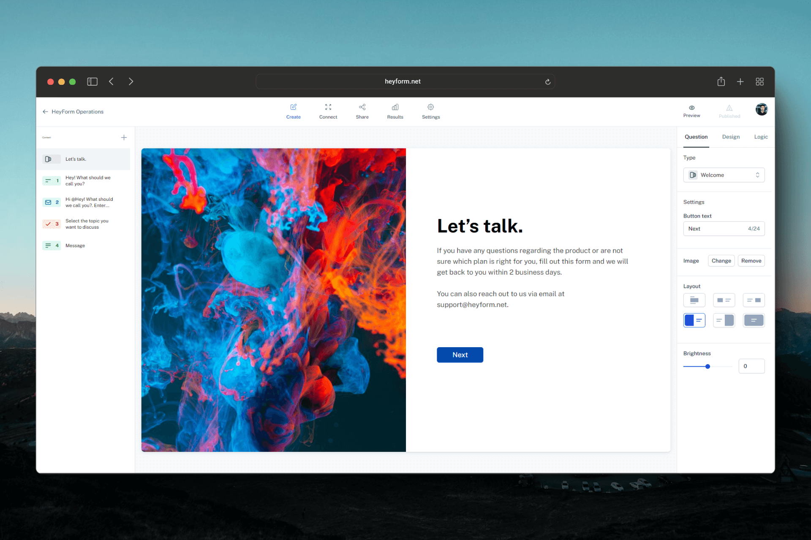

<div align="center">
  <h1 align="center">
    
  </h1>
  <p>HeyForm is an open-source form builder that allows anyone to create engaging conversational forms for surveys, questionnaires, quizzes, and polls. No coding skills required.</p>
</div>
<p align="center">
  <a target="_blank" href="https://heyform.net">Website</a> | <a target="_blank" href="https://docs.heyform.net">Documentation</a> | <a target="_blank" href="https://heyform.net/blog">Blog</a> | <a target="_blank" href="https://twitter.com/HeyformHQ">Twitter</a>
</p>

<p align="center">
<a href="https://trendshift.io/repositories/9025" target="_blank"></a>
</p>



## Features

HeyForm simplifies the creation of conversational forms, making it accessible for anyone to gather information or feedback through engaging surveys, quizzes, and polls. We are committed to enhancing HeyForm with regular updates, including bug fixes, new features, and performance improvements.

### Build Forms with Ease

- 📝 **Versatile Inputs**: From basic text, email, and phone number fields to advanced options like picture choices, date pickers, and file uploads, HeyForm supports a wide array of input types.
- 🧠 **Smart Logic**: Conditional logic and URL redirections for dynamic, adaptable forms.
- 🔗 **Powerful Integrations**: Connect with webhooks, analytics, marketing platforms, and tools like Zapier and Make.com.

### Customize to Your Brand

- 🎨 **Visual Themes**: Tailor the look and feel of your forms to match your brand identity with customizable fonts, colors, backgrounds, and more.
- ✨ **Advanced Theming**: Gain greater control with extensive customization options, including custom CSS for deeper personalization.

### Analyze and Act on Data

- 📊 **Insightful Analytics**: Gain insights with detailed analytics, including drop-off rates and completion rates.
- 📤 **Data Export**: Easily export your form results to CSV for further analysis or integration into your systems.

## Getting started with HeyForm

The simplest and most efficient way to dive into HeyForm is through [our official hosted service](https://my.heyform.net). When you choose this cloud version, you're getting the advantage of high reliability, automatic backups, robust security, and hassle-free maintenance—all carefully managed by us, the passionate duo behind HeyForm.

Choosing our hosted version not only saves a significant amount of time and resources but also supports HeyForm's development and the open-source community. Get a great service while backing innovation. 💙

## Structure

```
.
└── packages
    ├── answer-utils       (form submission utils for server and webapp)
    ├── embed              (form embed javascript library)
    ├── shared-types-enums (shared types/enums for server and webapp)
    ├── utils              (common utils for server and webapp)
    ├── server             (node server)
    └── webapp             (react webapp)
```

## Self-hosting

Interested in self-hosting HeyForm on your server? Take a look at the [self-hosting installation instructions](https://docs.heyform.net/open-source/self-hosting).

### One Click Deployment

<a href="https://railway.app/template/f5vBKm?referralCode=bDs1YJ">
	
</a>

<a href="https://zeabur.com/templates/9YAUUO" style="margin-left:8px">
	
</a>

<a href="https://cloud.sealos.io/?openapp=system-template%3FtemplateName%3Dheyform" style="margin-left:16px">
	
</a>

<a href="https://repocloud.io/details/?app_id=283" style="margin-left:24px">
	
</a>

<a href="https://computenest.console.aliyun.com/service/instance/create/cn-hangzhou?type=user&ServiceId=service-a47e56f0ea9f460d8d33" style="margin-left:24px">
	
</a>

## Local development

Follow the [local installation instructions](https://docs.heyform.net/open-source/local-development) to run the project locally.

## How to Contribute
You are awesome, let's build great software together. Head over to the [contribute docs](https://docs.heyform.net/open-source/contribute) to get started. 💪

## Support & Community

You'll find a lot of resources to help you get started with HeyForm in the [help center](https://docs.heyform.net). However, if you can't find what you're looking for there, don't hesitate to reach out to us:

- Have a question? Join the [Discord server](https://discord.gg/sgT4v4GSTe) and get instant help.
- Found a bug? [Create an issue](https://github.com/heyform/heyform/issues/new/choose)

## License

HeyForm is open-source under the GNU Affero General Public License v3.0 (AGPL-3.0), you will find more information about the license and how to comply with it [here](https://docs.heyform.net/open-source/license).
